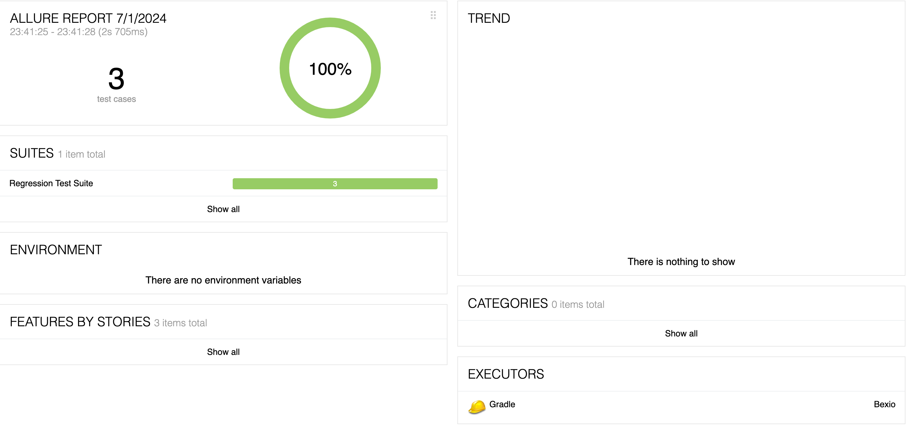

#
## Api Test framework
This is a Java Api Test framework that uses Java 17, Spring Boot, Rest Assured, Gradle, and TestNG

## Requirements
To run this application, you will need:
- Java 17
- Gradle

## With TestNG
Run the command **./gradlew clean test** to run all the tests that are present in suite.xml file.

## Reporting
This project uses Allure for reporting.
Use allureServe to generate reports locally

## Serialization/Deserialization and Formatting
This project uses Jackson(built-in RestAssured) for serialization/deserialization and Lombok plus Spotless for formatting.

## Environments
This project uses .yml files to execute tests on specific environments. Default is dev environment.
If you want to run the tests against another env, change it accordingly in resources/application.yml

## Data files
This project keeps data files (POJO) in /dto folder for request/response